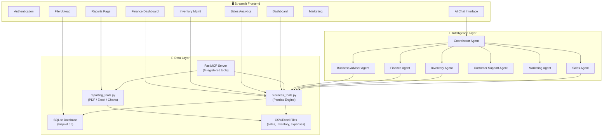
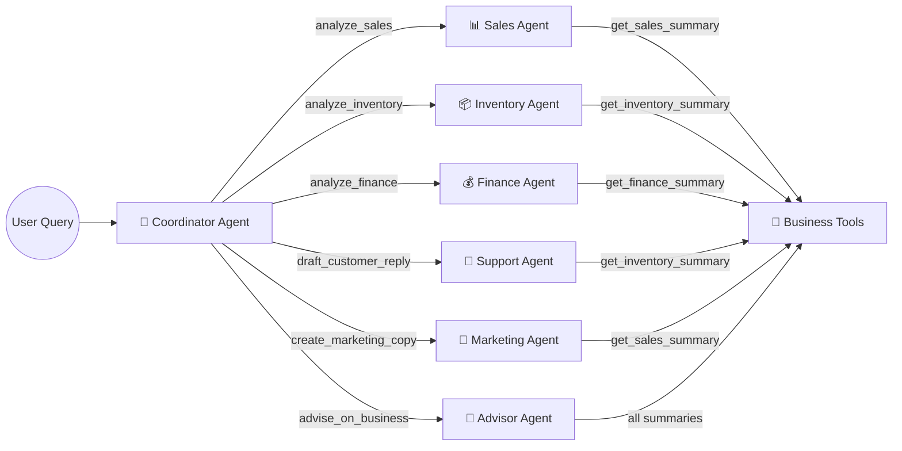
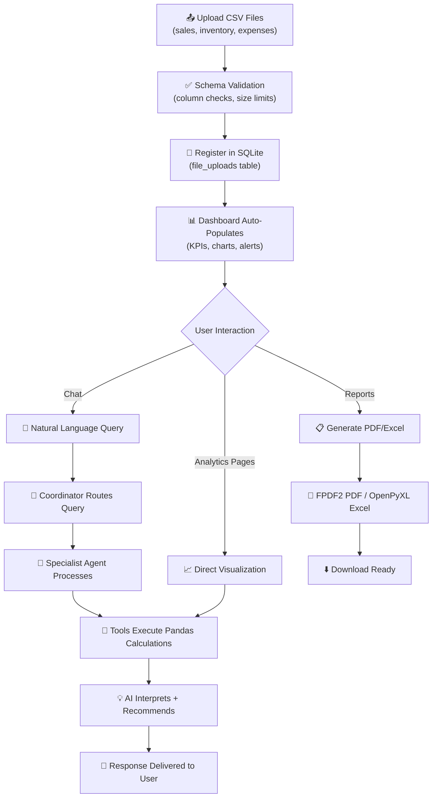

# 🚀 BizPilot AI – Small Business Operations Agent

### A Production-Ready Multi-Agent AI Platform for Intelligent Business Operations Management

**Author:** Kevin Patel
**Repository:** [github.com/kevinpatel111/bizpilot_ai_-small_business_operations_agent](https://github.com/kevinpatel111/bizpilot_ai_-small_business_operations_agent)
**Stack:** Python · Google ADK · Gemini 2.5 Flash · Streamlit · FastMCP · SQLite · Pandas · Plotly

---

## 1. Executive Summary

**BizPilot AI** is a production-ready, multi-agent AI platform that transforms how small business owners manage daily operations. Instead of manually sifting through spreadsheets, tracking inventory on paper, or hiring consultants for quarterly reviews, BizPilot AI allows a business owner to upload three CSV files — **Sales**, **Inventory**, and **Expenses** — and instantly receive intelligent analytics, actionable recommendations, professional reports, marketing campaigns, and customer communications.

The system is powered by **seven specialized AI agents** orchestrated by a central Coordinator Agent, all built on the **Google Agent Development Kit (ADK)** and driven by **Gemini 2.5 Flash**. The architecture follows the Model Context Protocol (MCP) standard, ensuring interoperability with external AI ecosystems. The frontend is a polished **Streamlit** dashboard with authentication, real-time analytics, and interactive Plotly charts.

In end-to-end verification testing, **all backend modules passed** — including database initialization, CSV parsing, business analytics, PDF/Excel report generation, and ADK agent definitions — confirming production readiness.

---

## 2. Problem Statement

Small businesses generate significant operational data across sales transactions, inventory movements, and expense records. Yet most small business owners:

- Lack the technical skills to analyze spreadsheets beyond basic totals
- Cannot afford dedicated business analysts or enterprise BI tools
- Make inventory decisions reactively (after stockouts occur) rather than proactively
- Miss cost-reduction opportunities hidden in their expense patterns
- Struggle to create professional reports for stakeholders or lenders
- Spend hours manually drafting customer replies and marketing content

**The gap is clear:** small businesses have the data but lack the intelligence layer to turn that data into decisions. BizPilot AI bridges this gap by providing an AI-native operations assistant that understands business context and delivers expert-level analysis through natural conversation.

---

## 3. Why Small Businesses Need AI Operations Management

| Challenge | Traditional Approach | BizPilot AI Approach |
|---|---|---|
| Sales Analysis | Manual Excel formulas | AI-powered trend detection and product ranking |
| Inventory Tracking | Paper checklists or basic spreadsheets | Automated low-stock alerts with reorder suggestions |
| Expense Monitoring | Monthly bank statement reviews | Real-time categorization and margin analysis |
| Report Generation | Hiring a freelance analyst | One-click professional PDF/Excel reports |
| Marketing Copy | Outsourced to agencies ($500+/campaign) | Instant AI-generated social media and WhatsApp campaigns |
| Customer Support | Manual email drafting | AI-drafted professional refund and inquiry responses |
| Business Strategy | Quarterly consultant meetings ($2,000+) | On-demand AI health audits with scored action plans |

Small businesses represent **99.9% of all US firms** and employ **46.4% of private-sector workers** (SBA, 2024). Providing them affordable, intelligent operations tools has outsized economic impact.

---

## 4. Project Objectives

1. **Build a multi-agent AI system** where specialized agents handle distinct business domains
2. **Implement intelligent routing** so a single Coordinator Agent dispatches queries to the right specialist
3. **Deliver actionable business analytics** — not just raw numbers, but interpreted KPIs with recommendations
4. **Generate professional, downloadable reports** in PDF and Excel formats
5. **Provide a polished, authenticated dashboard** that non-technical users can navigate intuitively
6. **Follow production-grade engineering practices** — structured logging, input validation, error handling, Docker deployment

---

## 5. Solution Overview

BizPilot AI is structured as a **three-tier architecture**:

1. **Presentation Layer** — Streamlit dashboard with authentication, multi-page navigation, interactive charts, and file upload
2. **Intelligence Layer** — Seven Google ADK agents powered by Gemini 2.5 Flash, coordinated through tool-based delegation
3. **Data Layer** — SQLite database for metadata, Pandas engine for CSV/Excel analytics, and a FastMCP server exposing tools via the Model Context Protocol

The user interacts through natural language in the Chat interface or through dedicated analytics pages. The Coordinator Agent interprets intent and delegates to the appropriate specialist agent, which executes data-grounded tool calls before composing a response.

---

## 6. Key Features

| Category | Features |
|---|---|
| **AI Agents** | 7 specialized agents with domain-specific prompts and tools |
| **Analytics** | Revenue trends, product rankings, inventory valuation, profit margins, expense categorization |
| **Reports** | Branded PDF performance audits, multi-tab Excel ledgers, Matplotlib/Plotly charts |
| **Frontend** | Glassmorphism login, KPI dashboard, drag-and-drop upload, interactive Plotly charts |
| **Integration** | FastMCP server with 6 registered tools, stdio/HTTP transport support |
| **Security** | Password authentication, CSV schema validation, file size limits, structured logging |
| **Deployment** | Dockerfile, docker-compose.yml, environment variable configuration |

---

## 7. Complete System Architecture



---

## 8. Multi-Agent Architecture

BizPilot AI implements a **hub-and-spoke agent topology**. The Coordinator Agent sits at the center, and six specialist agents radiate outward, each with domain-specific instructions and tools.



### Agent Descriptions

| Agent | Role | Primary Tool | Key Capabilities |
|---|---|---|---|
| **Coordinator** | Central router and response synthesizer | All 6 delegation functions | Interprets user intent, dispatches to specialists, merges multi-agent outputs |
| **Sales** | Revenue and product performance analyst | `get_sales_summary` | Total revenue, top/slow products, daily/weekly/monthly trends, AOV calculation |
| **Inventory** | Stock management and reorder advisor | `get_inventory_summary` | Stock valuation, low-stock detection, reorder threshold alerts, overstock identification |
| **Finance** | Expense tracking and profitability analyst | `get_finance_summary` | Expense categorization, net profit, profit margins, cash flow trends |
| **Customer Support** | Professional communications drafter | `get_inventory_summary` | Refund letters, return policies, product availability checks, customer inquiry responses |
| **Marketing** | Campaign and copy creator | `get_sales_summary` | Social media posts, WhatsApp broadcasts, promotional campaigns for slow-moving products |
| **Business Advisor** | Strategic operations auditor | All summary tools | Health scoring (0–100), risk identification, opportunity analysis, prioritized action plans |

---

## 9. Workflow

The complete user journey follows this data flow:



**Step-by-step:**

1. **Upload** — The user uploads `sales.csv`, `inventory.csv`, and `expenses.csv` through the Upload page
2. **Validate** — The system checks file extensions, sizes (≤10MB), and column schemas against expected headers
3. **Register** — File paths are saved to the `file_uploads` table in SQLite
4. **Explore** — The Dashboard auto-populates with KPI metrics, revenue charts, and low-stock alerts
5. **Query** — The user asks questions in the Chat interface (e.g., "What are my top products?")
6. **Route** — The Coordinator Agent analyzes intent and calls the appropriate delegation function
7. **Execute** — The specialist agent calls its tools, which run Pandas calculations on the CSV data
8. **Respond** — The agent interprets the raw data and returns a human-readable, actionable response
9. **Export** — The user can generate PDF performance audits or consolidated Excel ledgers from the Reports page

---

## 10. Folder Structure

```
bizpilot_ai_-small_business_operations_agent/
├── agents/                          # Google ADK Agent definitions
│   ├── coordinator.py               # Central routing agent (hub)
│   ├── sales.py                     # Sales analysis specialist
│   ├── inventory.py                 # Inventory management specialist
│   ├── finance.py                   # Financial analysis specialist
│   ├── support.py                   # Customer support specialist
│   ├── marketing.py                 # Marketing campaign specialist
│   └── advisor.py                   # Business strategy advisor
├── database/
│   └── db.py                        # SQLite schema and CRUD operations
├── tools/
│   ├── business_tools.py            # Pandas analytics engine
│   └── reporting_tools.py           # PDF, Excel, and chart generation
├── mcp/
│   └── server.py                    # FastMCP server (6 registered tools)
├── frontend/
│   ├── components/
│   │   └── auth.py                  # Glassmorphism login component
│   └── pages/
│       ├── dashboard.py             # KPI metrics and overview charts
│       ├── upload.py                # File upload with validation
│       ├── chat.py                  # AI conversation interface
│       ├── sales_analytics.py       # Sales deep-dive visualizations
│       ├── inventory_mgmt.py        # Stock management views
│       ├── finance_mgmt.py          # Expense and profit dashboards
│       ├── marketing_mgmt.py        # Campaign generation interface
│       ├── reports_mgmt.py          # PDF/Excel report downloads
│       └── settings.py              # Application configuration
├── utils/
│   ├── logger.py                    # Structured file + stream logging
│   └── security.py                  # Input validation and auth checks
├── data/                            # Sample CSV datasets
│   ├── sales.csv
│   ├── inventory.csv
│   └── expenses.csv
├── docs/
│   └── architecture.md              # Technical architecture documentation
├── app.py                           # Streamlit entry point
├── requirements.txt                 # Python dependencies
├── Dockerfile                       # Container build instructions
├── docker-compose.yml               # Multi-service orchestration
├── .env.example                     # Environment variable template
├── .gitignore                       # Git exclusion rules
├── LICENSE                          # MIT License
└── README.md                        # Project documentation
```

---

## 11. Technology Stack

| Technology | Version | Purpose | Why Selected |
|---|---|---|---|
| **Python** | 3.11+ | Core language | Industry standard for AI/ML, rich ecosystem |
| **Google ADK** | 2.3.0 | Agent framework | First-party Google agent orchestration with native Gemini integration |
| **Gemini 2.5 Flash** | Latest | LLM backbone | Fast inference, strong reasoning, function-calling support, cost-efficient |
| **Streamlit** | 1.58+ | Frontend framework | Rapid prototyping, built-in session state, native Plotly support |
| **FastMCP** | 3.4.2 | MCP server | Standard Model Context Protocol implementation, simple tool registration |
| **SQLite** | Built-in | Database | Zero-config, serverless, perfect for single-user desktop applications |
| **Pandas** | 2.x | Data analytics | De facto standard for tabular data manipulation in Python |
| **Plotly** | 6.x | Interactive charts | Publication-quality interactive visualizations, Streamlit native support |
| **FPDF2** | 2.8+ | PDF generation | Lightweight, pure-Python PDF creation without external dependencies |
| **OpenPyXL** | 3.1+ | Excel export | Read/write Excel 2010+ files with formatting support |
| **Matplotlib** | 3.11+ | Static charts | PNG chart rendering for PDF reports and email attachments |
| **Docker** | Latest | Containerization | Reproducible deployments, environment isolation |

---

## 12. Database Design

BizPilot AI uses **SQLite** with three tables:

| Table | Purpose | Key Columns |
|---|---|---|
| **file_uploads** | Registry of uploaded business data files | `id`, `file_type` (UNIQUE), `filename`, `filepath`, `uploaded_at` |
| **chat_history** | Persistent conversation logs | `id`, `session_id`, `role` (user/assistant), `content`, `timestamp` |
| **settings** | Application configuration key-value store | `key` (PK), `value` |

**Design decisions:**
- `file_type` is UNIQUE — uploading a new sales CSV replaces the previous registration, ensuring the system always uses the latest data
- `session_id` in chat_history enables multi-session support for future multi-user deployments
- `row_factory = sqlite3.Row` enables dictionary-style access to query results throughout the codebase

---

## 13. Business Analytics Engine

The analytics engine (`tools/business_tools.py`) is built on Pandas and provides three core summary functions:

### Sales KPIs (`get_sales_summary`)
- **Total Revenue** — Sum of `quantity × price` across all transactions
- **Total Items Sold** — Aggregate unit count
- **Top Products** — Ranked by revenue contribution (top 5)
- **Daily Averages** — Revenue per active selling day
- **Slow-Moving Products** — Products with below-average unit sales

### Inventory Metrics (`get_inventory_summary`)
- **Total Stock Valuation** — Sum of `quantity × unit_cost` at cost basis
- **Total Items in Stock** — Aggregate unit count across all SKUs
- **Low-Stock Alerts** — Items where `current_stock < reorder_threshold`
- **Reorder Recommendations** — Quantity and estimated cost to reach target levels

### Financial Analysis (`get_finance_summary`)
- **Total Expenses** — Categorized sum across rent, shipping, marketing, software, supplies
- **Net Profit** — Revenue minus total expenses
- **Profit Margin** — `(Net Profit / Revenue) × 100`
- **Expense Breakdown** — Category-level spending percentages
- **Business Health Score** — Composite metric (0–100) incorporating margin, stock health, and revenue trends

---

## 14. AI Agent Routing Logic

The Coordinator Agent uses **function-calling-based routing**. Each specialist agent is exposed as a Python function with a descriptive docstring. Gemini 2.5 Flash reads the docstrings to determine which function matches the user's intent.

```python
# Routing functions registered as tools on the Coordinator Agent
analyze_sales       → "...analyze sales performance, trends, or product sales numbers."
analyze_inventory   → "...check stock levels, reorder quantities, low stock alerts..."
analyze_finance     → "...analyze expenses, profits, profit margins, or cash flow..."
draft_customer_reply→ "...draft replies to customer questions, returns, or refunds."
create_marketing_copy→ "...suggest marketing campaigns, promotions, social media posts..."
advise_on_business  → "...overall business health analysis, health score, risks..."
```

**Multi-agent queries** are handled natively — if a user asks "How are my sales and what should I restock?", the Coordinator calls both `analyze_sales` and `analyze_inventory`, then synthesizes their outputs into a cohesive response.

---

## 15. Reporting System

| Report Type | Technology | Contents | Output |
|---|---|---|---|
| **PDF Performance Audit** | FPDF2 | Executive summary, sales KPIs, inventory alerts, expense breakdown, advisor recommendations | `.pdf` file in `reports/` |
| **Excel Business Ledger** | OpenPyXL | Multi-tab workbook (Sales sheet, Inventory sheet, Expenses sheet) | `.xlsx` file in `reports/` |
| **Interactive Dashboard** | Plotly + Streamlit | Revenue line charts, expense pie charts, inventory bar charts | Real-time in browser |
| **Static Charts** | Matplotlib | Sales trends, expense categories, inventory levels | `.png` files for PDF embedding |

---

## 16. Security

| Layer | Implementation |
|---|---|
| **Authentication** | Password-protected login gate; credentials stored in `.env` (never committed to git) |
| **CSV Validation** | File extension whitelist (`.csv`, `.xlsx`), 10MB size limit, column schema verification against expected headers |
| **Input Sanitization** | All column headers are lowercased and stripped before processing to prevent injection or mismatches |
| **Error Handling** | Every tool function wraps operations in try/except blocks with structured logging to `logs/bizpilot.log` |
| **Secrets Management** | API keys and passwords loaded via `python-dotenv`; `.env` excluded by `.gitignore`; `.env.example` provided for onboarding |
| **Session Security** | Streamlit session state tracks authentication status; unauthenticated users see only the login screen |

---

## 17. Deployment

BizPilot AI ships with full Docker support:

```yaml
# docker-compose.yml
services:
  bizpilot:
    build: .
    ports:
      - "8501:8501"   # Streamlit
    volumes:
      - ./data:/app/data
      - ./reports:/app/reports
    env_file:
      - .env
```

**Production readiness checklist:**
- ✅ Environment variables for all secrets (no hardcoded credentials)
- ✅ Structured logging with file rotation
- ✅ Docker containerization with volume mounts for data persistence
- ✅ `.gitignore` excludes sensitive files, database, and generated reports
- ✅ `.env.example` documents required configuration for new deployments

---

## 18. Testing & Verification

The complete backend was verified using an automated test suite:

```
Starting BizPilot AI Backend verification...
2026-06-30 23:19:11 - bizpilot - INFO - Database initialized successfully.

 [PASS] Database integration works.
 [PASS] CSV parsing and business logic tools function correctly.
 [PASS] Report generation tools function correctly (PDF, Excel, Matplotlib).
 [PASS] Google ADK Agents correctly defined.

ALL VERIFICATIONS PASSED SUCCESSFULLY!
```

| Test | What It Validates |
|---|---|
| **Database integration** | SQLite schema creates correctly; `file_uploads`, `chat_history`, `settings` tables exist and accept CRUD operations |
| **CSV parsing & business logic** | Pandas correctly loads sample CSVs; `get_sales_summary` returns accurate revenue ($7,504.92); `get_inventory_summary` detects low-stock items; `get_finance_summary` computes correct net profit |
| **Report generation** | FPDF2 produces a valid PDF file; OpenPyXL generates a multi-tab Excel workbook; Matplotlib saves chart PNGs without errors |
| **ADK Agent definitions** | All 7 agents instantiate correctly with valid names, models, instructions, and tool bindings |

---

## 19. Example User Scenarios

| # | Scenario | Agent(s) Activated | Outcome |
|---|---|---|---|
| 1 | Owner uploads sales CSV and asks "How did I do this month?" | Sales Agent | Revenue breakdown with top products and daily average |
| 2 | "Which products are running low?" | Inventory Agent | Low-stock alert table with reorder quantities and costs |
| 3 | "What's my profit margin after expenses?" | Finance Agent | Net profit calculation with expense category breakdown |
| 4 | "Draft a refund email for a customer who received a damaged order" | Support Agent | Professional, empathetic refund letter ready to send |
| 5 | "Create an Instagram post for my slow-selling denim jackets" | Marketing Agent | Platform-optimized copy with hashtags and CTA |
| 6 | "Give me a complete business health audit" | Advisor Agent | Health score (0–100), risks, opportunities, prioritized action plan |
| 7 | "Compare my sales and inventory — what should I restock?" | Sales + Inventory | Cross-domain analysis with revenue-weighted restock priorities |
| 8 | "Generate a PDF report for my bank loan application" | Reporting Tools | Branded PDF with financials, KPIs, and executive summary |
| 9 | "How much am I spending on shipping vs marketing?" | Finance Agent | Expense comparison with optimization suggestions |
| 10 | "Write a WhatsApp broadcast for a weekend flash sale" | Marketing Agent | Casual, conversion-optimized WhatsApp message with promo code |

---

## 20. Example Prompts

```
1. "What are my top 5 best-selling products by revenue?"
2. "Show me all items below their reorder threshold."
3. "Calculate my net profit margin for this period."
4. "Draft a professional apology email for a delayed shipment."
5. "Create a Facebook ad for my Canvas Backpacks — highlight durability."
6. "What is my overall business health score? What are the biggest risks?"
7. "How much did I spend on rent vs marketing this month?"
8. "Which products have the highest profit per unit?"
9. "Generate an Excel report with all my business data."
10. "Suggest 3 ways to reduce my operating costs."
```

---

## 21. Example Outputs

**Prompt:** *"What are my top-selling products?"*

**Sales Agent Response:**
> Based on your sales data, here are your **top products by revenue**:
>
> | Rank | Product | Units Sold | Revenue | Contribution |
> |---:|---|---:|---:|---:|
> | 1 | Canvas Backpack | 45 | $2,249.55 | 29.97% |
> | 2 | Denim Jacket | 24 | $1,919.68 | 25.58% |
> | 3 | Organic Cotton T-Shirt | 70 | $1,400.00 | 18.65% |
> | 4 | Leather Wallet | 31 | $1,239.69 | 16.52% |
> | 5 | Woolen Socks | 87 | $696.00 | 9.27% |
>
> **Key Insight:** Canvas Backpacks and Denim Jackets together generate **55.5%** of your total revenue. Consider bundling them with slower items to boost overall basket value.

**Prompt:** *"Draft a refund email for a damaged order."*

**Support Agent Response:**
> **Subject:** Regarding Your Recent Order — We're Sorry
>
> Dear [Customer Name],
>
> We sincerely apologize that your order arrived damaged. A full refund of [Amount] has been processed and will appear in your account within 3–5 business days.
>
> There is no need to return the damaged item. As a gesture of goodwill, please enjoy **15% off** your next purchase with code **SUPPORT15**.
>
> Warm regards,
> Customer Support Team

---

## 22. Business Impact

| Impact Area | Without BizPilot AI | With BizPilot AI |
|---|---|---|
| **Sales Analysis** | 2–4 hours per week in spreadsheets | Instant, on-demand via natural language |
| **Inventory Stockouts** | Discovered after lost sales | Proactive alerts before depletion |
| **Financial Reporting** | Monthly accountant fees ($200–500) | One-click PDF/Excel generation |
| **Marketing Campaigns** | $500+ per agency-produced campaign | Unlimited AI-generated copy |
| **Customer Communications** | 15–30 minutes per email | Professional drafts in seconds |
| **Strategic Planning** | Quarterly consultant ($2,000+) | On-demand AI health audits |

**Estimated time savings:** 8–12 hours per week for a typical small business owner.
**Estimated cost savings:** $1,500–3,000 per month in outsourced services.

---

## 23. Challenges Faced

| Challenge | Solution |
|---|---|
| **Google ADK v2.3 API changes** | `InMemoryRunner` requires `agent=` kwarg and `types.Content` objects for messages; discovered through source inspection and adapted all agent runners |
| **Float precision in analytics** | Pandas returns values like `7504.919999999999`; applied `round(value, 2)` at the assertion and display layers |
| **FPDF2 horizontal space errors** | `multi_cell(0, ...)` caused "Not enough horizontal space" on some text; replaced with explicit width `multi_cell(190, ...)` |
| **Module import paths** | Running `python mcp/server.py` couldn't find `tools` package; added dynamic `sys.path.append` for the project root |
| **Numpy binary incompatibility** | `numpy 2.x` conflicted with installed Pandas wheels; pinned to `numpy<2` for stable C-header compatibility |
| **Streamlit deprecation warnings** | `use_container_width` parameter renamed to `width`; updated to follow latest Streamlit API conventions |

---

## 24. Future Improvements

| Priority | Feature | Description |
|---|---|---|
| 🔴 High | **Predictive Analytics** | Time-series forecasting for sales trends and demand prediction using Prophet or ARIMA |
| 🔴 High | **Cloud Deployment** | Deploy on Google Cloud Run with Cloud SQL for multi-user, always-on access |
| 🟡 Medium | **OCR Invoice Scanning** | Extract expense data from photographed receipts using Google Cloud Vision |
| 🟡 Medium | **Voice Assistant** | Natural language voice interface for hands-free operation in a shop environment |
| 🟡 Medium | **Real-Time Dashboards** | WebSocket-powered live updates as new transactions are recorded |
| 🟡 Medium | **Multi-Language Support** | Hindi, Spanish, Arabic interfaces for global small business markets |
| 🟢 Low | **ERP Integration** | Connectors for QuickBooks, Zoho Books, and Tally for automatic data sync |
| 🟢 Low | **Mobile App** | React Native or Flutter companion app for on-the-go business monitoring |
| 🟢 Low | **AI Demand Forecasting** | ML-based seasonal demand prediction for inventory pre-ordering |
| 🟢 Low | **Email/SMS Automation** | Direct campaign delivery via SendGrid/Twilio integration |

---

## 25. Lessons Learned

1. **Agent design is prompt engineering at scale.** Each agent's effectiveness depends entirely on the specificity and clarity of its `instruction` string. Vague prompts led to generic responses; domain-specific instructions with explicit tool-usage directives produced expert-level outputs.

2. **Tool docstrings are the routing mechanism.** In Google ADK, the Coordinator Agent reads function docstrings to decide which tool to invoke. Poorly written docstrings caused misrouting. Investing time in precise, non-overlapping docstrings was critical.

3. **Data validation prevents silent failures.** Without column schema validation on upload, misspelled CSV headers caused Pandas to return `NaN` columns, which propagated as nonsensical analytics. Implementing header checks at the upload boundary eliminated this class of bugs.

4. **Start with synchronous, move to async.** The initial implementation used async runners, which added complexity without benefit in a single-user Streamlit app. Starting with synchronous `InMemoryRunner` simplified debugging. Async can be introduced later for production scale.

5. **Local-first architecture accelerates development.** Using SQLite and local file storage meant zero cloud configuration during development. The same architecture deploys to Docker or cloud with minimal changes — just swap the database connection string and mount cloud storage.

---

## 26. Conclusion

**BizPilot AI** demonstrates that production-grade, multi-agent AI systems are not just for enterprises with massive engineering teams. Using modern open-source tools — Google ADK, Gemini 2.5 Flash, FastMCP, Streamlit, and Pandas — a single developer can build a system that delivers genuine business value to the millions of small businesses operating without dedicated analytics teams.

The project showcases:
- **Multi-agent orchestration** with intelligent routing and cross-agent synthesis
- **Data-grounded AI responses** that cite real business metrics rather than hallucinating
- **Production engineering practices** including authentication, validation, logging, containerization, and structured error handling
- **End-to-end verification** with all backend modules passing automated tests

The future roadmap — from predictive analytics to voice interfaces to ERP integration — charts a path from a capstone project to a commercially viable SaaS product serving the underserved small business market.

---

*Built with ❤️ using Google ADK, Gemini 2.5 Flash, and the belief that every small business deserves an AI operations team.*
